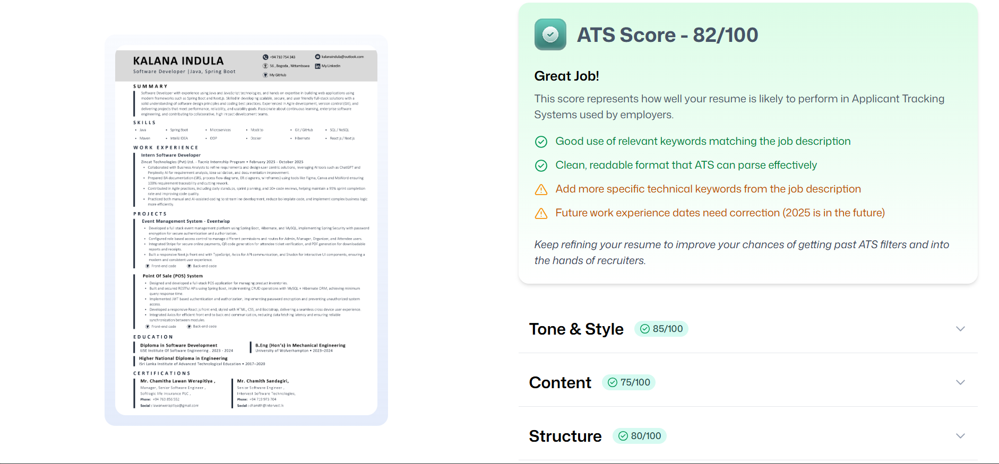
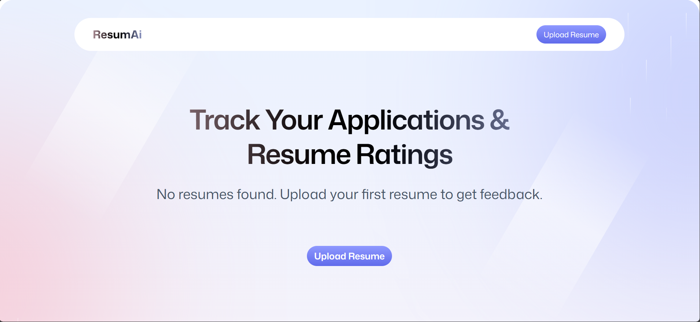

# 📌 AI Resume Analyzer

An AI-powered web application that evaluates résumés against specific job descriptions and provides targeted, actionable feedback to improve job alignment, skills presentation, and ATS compatibility.


---

## 🔥 Overview

**AI Resume Analyzer** helps job seekers tailor their résumés to specific roles by analyzing both the résumé and job description using AI. It provides scored evaluations, missing skills, tone/style improvements, and structural enhancements to increase interview readiness.

This tool is built for students, job seekers, freelancers, and professionals who apply to multiple roles and need quick, targeted refinements.

---

## ✨ Key Features

- 📎 Upload résumé + paste job description
- 🤖 AI-based semantic analysis using **Puter**
- 📊 Category-based scoring:
    - Tone & Style
    - Content Quality
    - Structure & Formatting
    - Skills & Keyword Match
- 🔍 ATS-friendly optimization
- 🧩 Missing skills & keyword detection
- 🗒 Actionable improvement suggestions

---

## 🚀 Getting Started

### Prerequisites

- Node.js & npm installed
- Access to Puter API or model

```shell
git clone https://github.com/<your-username>/<repo-name>.git
cd <repo-name>
npm install

```

```shell
npm start
```

## 📸 Screenshots







